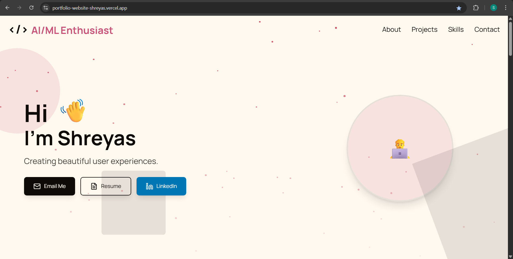
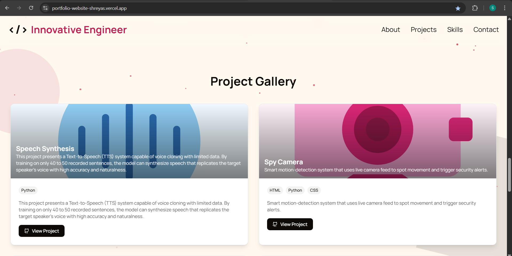

# Shreyas’s Portfolio Website

A sleek, responsive portfolio website showcasing my projects, skills, and contact information.

---

## 🚀 Features

- **Responsive Design**: Works on mobile, tablet, and desktop.
- **Projects Gallery**: Interactive showcase of my latest work.
- **Dark / Light Mode**: Toggle for light and dark themes.
- **Contact Form**: Send me a message directly from the site.
- **Fast Performance**: Built with modern frameworks for lightning‑fast load times.

---

## 🛠️ Built With

- [Next.js](https://nextjs.org/)
- [React](https://reactjs.org/)
- [Tailwind CSS](https://tailwindcss.com/)
- [Vercel](https://vercel.com/) for deployment

---

## 📸 Screenshots

  
  &nbsp;&nbsp;
  

